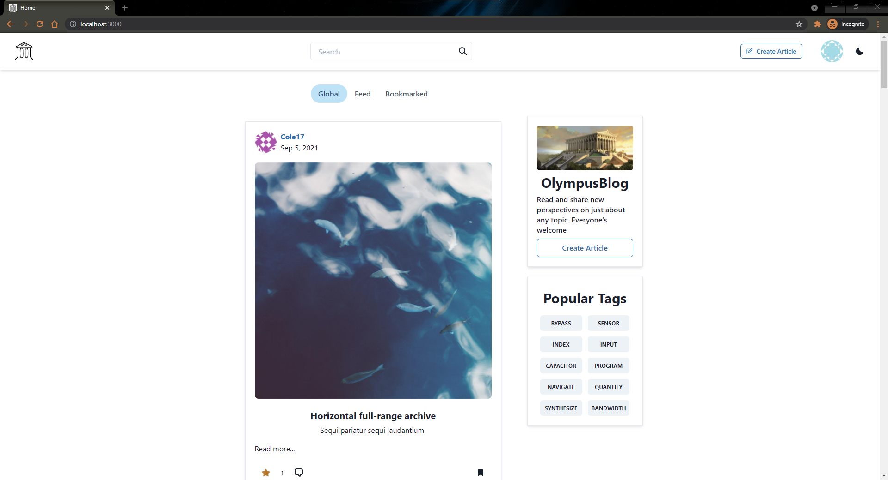
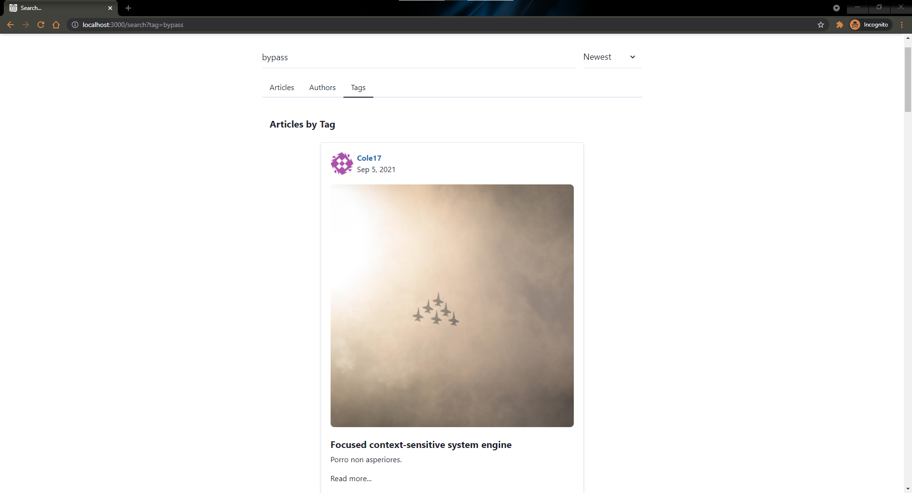
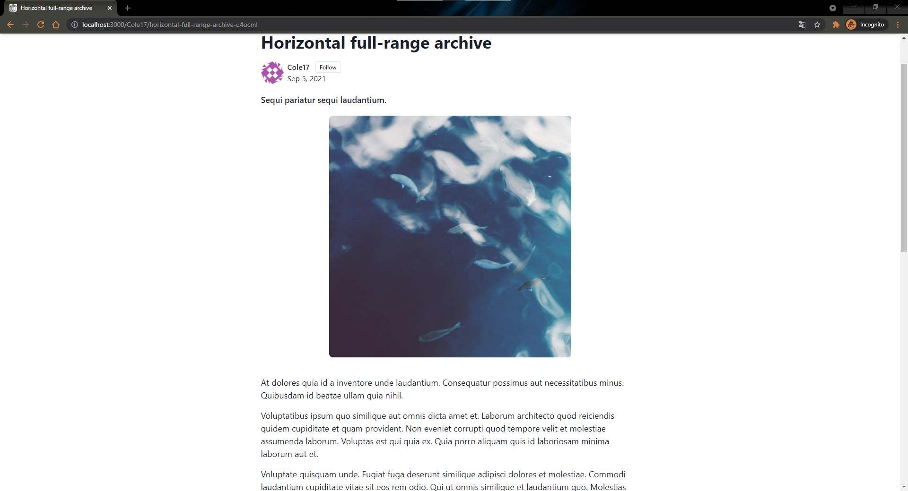
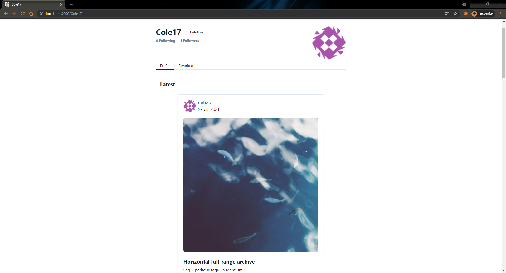
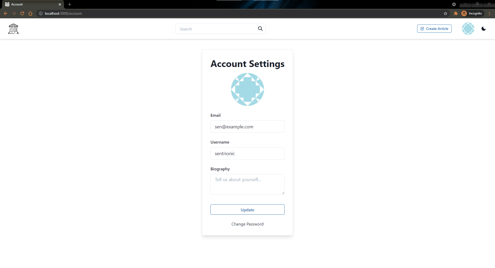
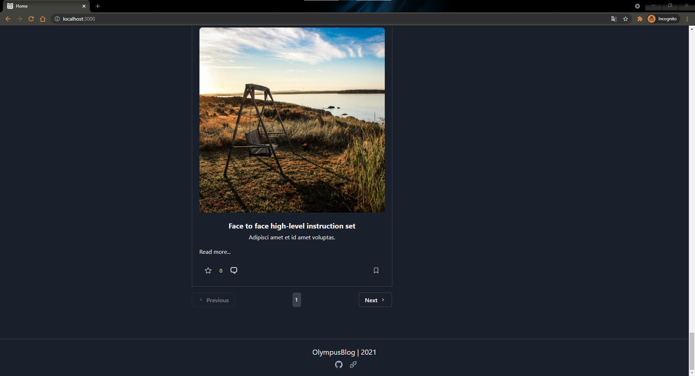

# OlympusNext

OlympusNext is a frontend for the [OlympusBlog](https://github.com/sentrionic/OlympusBlog) stack using NextJS with Typescript.

For all the features and endpoints check out the parent repository.

## Screenshots

<table><tr>
  <tr>
    <td></td>
    <td></td>
    <td></td>
    </tr>
    <tr>
    <td></td>
    <td></td>
    <td></td>
  </tr>
  </table>

## Getting started

1. Clone this repository and one of the many backends.
2. Run `yarn` to install the dependencies
3. Create a `.env.local` and add `NEXT_PUBLIC_API_URL=http://localhost:PORT/api` to, where `PORT` is whichever backend you picked.
4. Run `yarn dev` and go to `http://localhost:3000`
